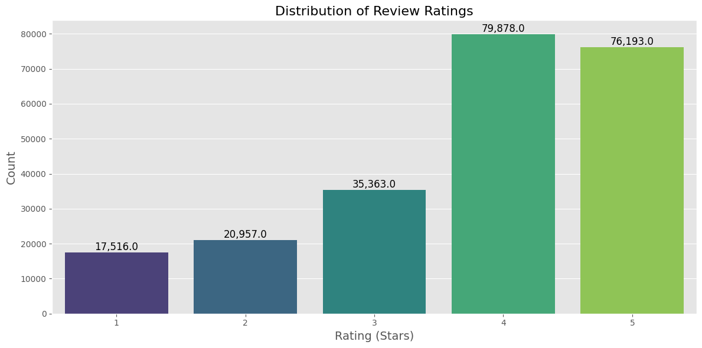
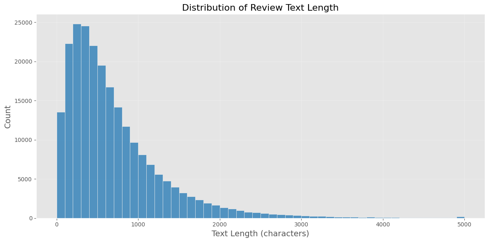
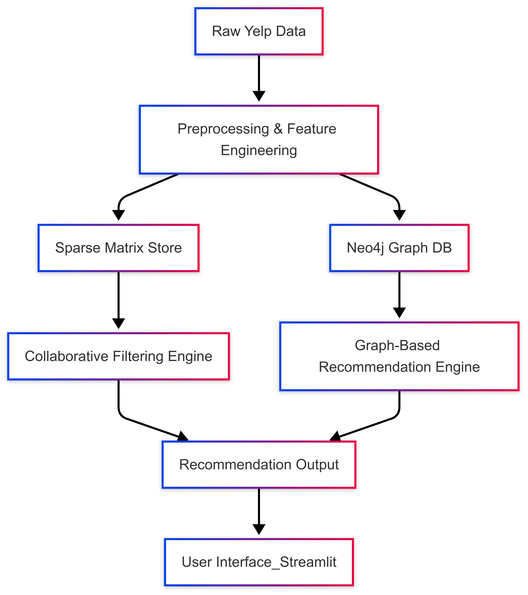

<div align="center">

# Improve Recommender Systems using Knowledge Graphs

## Report

### CS F377 DESIGN PROJECT

By

**Jannath Shaik**  
IDNO: 2021A7PS0132U

Under the supervision of

**Dr. Sujala D. Shetty**


BIRLA INSTITUTE OF TECHNOLOGY AND SCIENCE, PILANI  
DUBAI CAMPUS, DUBAI UAE  
April - 2025

</div>

---

## ACKNOWLEDGEMENTS

I would like to express my deepest sense of gratitude, first and foremost, to my Supervisor Dr Sujala D. Shetty, Professor, Computer Science Department, BITS Pilani, Dubai campus, United Arab Emirates, for her valuable guidance and encouragement during the course of this Project. I am extremely grateful to her for her able guidance, valuable technical inputs and useful suggestions.

I express sincere thanks and gratitude to my Project Supervisor: Dr. Sujala D. Shetty, our Director, BITS Pilani, Dubai Campus, Prof. Dr Souri Banerjee, Project Ins/i/c Dr. B. Vijayakumar for their motivation, encouragement and support to pursue my Project.

I am grateful to examiners for their valuable suggestions.

Above all, I thank almighty for giving me the strength to carry out this work to the best of my abilities.

Name: Jannath Shaik  
ID No.: 2021A7PS0132U

---

## CERTIFICATE

This is to certify that the Semester Project Report entitled, **Improve Recommender Systems using Knowledge Graphs** and submitted by Jannath Shaik ID No. 2021A7PS0132U in complete fulfillment of the requirement CS F491 SPECIAL PROJECT embodies the work done by her under my supervision.

Date: 15/04/2025 Signature of the Supervisor  
&nbsp;&nbsp;&nbsp;&nbsp;&nbsp;&nbsp;&nbsp;&nbsp;&nbsp;&nbsp;&nbsp;&nbsp;&nbsp;&nbsp;&nbsp;&nbsp;&nbsp;&nbsp;&nbsp;&nbsp;&nbsp;&nbsp;&nbsp;&nbsp;&nbsp;&nbsp;&nbsp;&nbsp;&nbsp;&nbsp;&nbsp;&nbsp;&nbsp;&nbsp;&nbsp;&nbsp;&nbsp;&nbsp;&nbsp;&nbsp;&nbsp;&nbsp;&nbsp;&nbsp;&nbsp;&nbsp;&nbsp;&nbsp;&nbsp;&nbsp;&nbsp;&nbsp;&nbsp;&nbsp;&nbsp;&nbsp;&nbsp;&nbsp;&nbsp;&nbsp;&nbsp;&nbsp;&nbsp;&nbsp;&nbsp;Name: Dr Sujala D. Shetty  
&nbsp;&nbsp;&nbsp;&nbsp;&nbsp;&nbsp;&nbsp;&nbsp;&nbsp;&nbsp;&nbsp;&nbsp;&nbsp;&nbsp;&nbsp;&nbsp;&nbsp;&nbsp;&nbsp;&nbsp;&nbsp;&nbsp;&nbsp;&nbsp;&nbsp;&nbsp;&nbsp;&nbsp;&nbsp;&nbsp;&nbsp;&nbsp;&nbsp;&nbsp;&nbsp;&nbsp;&nbsp;&nbsp;&nbsp;&nbsp;&nbsp;&nbsp;&nbsp;&nbsp;&nbsp;&nbsp;&nbsp;&nbsp;&nbsp;&nbsp;&nbsp;&nbsp;&nbsp;&nbsp;&nbsp;&nbsp;&nbsp;&nbsp;&nbsp;&nbsp;&nbsp;&nbsp;&nbsp;&nbsp;&nbsp;Designation: Assoc. Professor (CS)

---

## BITS Pilani, Dubai Campus

**First Semester 2024-2025**

**Project Course Code and Course Name:** CS F377 DESIGN PROJECT  
**Semester:** II Semester 2024-2025  
**Duration:** 05/02/2025-24/05/2025  
**Date of Start:** 05/02/2025  
**Date of Submission:** 15/04/2025  
**Title of the Report:** Improve Recommender Systems using Knowledge Graphs  
**ID No. / Name of the student:** 2021A7PS0132U / Jannath Shaik  
**Discipline of Student:** B.E Computer Science  
**Name of the Project Supervisor:** Dr Sujala D. Shetty  
**Key Words:** Recommendation System; Graph Database; Yelp Recommendations; Data Visualization; Graph Neural Networks  
**Project Area:** Recommendation System

**ABSTRACT:**
This project develops a comprehensive recommendation system for Yelp business reviews, implementing two primary recommendation strategies: collaborative filtering and graph-based recommendations. The collaborative filtering approach utilizes matrix factorization techniques to identify latent factors affecting user preferences, while the graph-based system leverages Neo4j to represent and query complex relationships between users, businesses, and attributes. The implementation features a user-friendly Streamlit interface allowing users to explore recommendations, compare different recommendation strategies, and visualize user-business relationships. The system architecture demonstrates scalability while maintaining reasonable response times, making it suitable for real-world applications. Both approaches offer complementary strengths, with collaborative filtering excelling in prediction accuracy for users with sufficient history, while graph-based methods provide contextual recommendations and better address the cold-start problem.

**Signature of Student:** Jannath Shaik  
**Date:** 15/04/2025

**Signature of Supervisor:**  
**Date:** 15/04/2025

---

## TABLE OF CONTENTS

[ACKNOWLEDGEMENTS](#acknowledgements)  
[CERTIFICATE](#certificate)  
[ABSTRACT](#bits-pilani-dubai-campus)  
[TABLE OF CONTENTS](#table-of-contents)

[**Chapter 1: Introduction**](#chapter-1-introduction)  
&nbsp;&nbsp;&nbsp;&nbsp;[1.1 Background and Significance](#11-background-and-significance)  
&nbsp;&nbsp;&nbsp;&nbsp;[1.2 Motivation](#12-motivation)  
&nbsp;&nbsp;&nbsp;&nbsp;[1.3 Challenges](#13-challenges)

[**Chapter 2: Literature Review**](#chapter-2-literature-review)  
&nbsp;&nbsp;&nbsp;&nbsp;[2.1 Evolution of Recommendation Systems](#21-evolution-of-recommendation-systems)  
&nbsp;&nbsp;&nbsp;&nbsp;[2.2 Collaborative Filtering Approaches](#22-collaborative-filtering-approaches)  
&nbsp;&nbsp;&nbsp;&nbsp;[2.3 Content-Based Filtering](#23-content-based-filtering)  
&nbsp;&nbsp;&nbsp;&nbsp;[2.4 Graph-Based Recommendation](#24-graph-based-recommendation)  
&nbsp;&nbsp;&nbsp;&nbsp;[2.5 Deep Learning in Recommendation](#25-deep-learning-in-recommendation)

[**Chapter 3: Dataset Description**](#chapter-3-dataset-description)  
&nbsp;&nbsp;&nbsp;&nbsp;[3.1 Dataset Overview](#31-dataset-overview)  
&nbsp;&nbsp;&nbsp;&nbsp;[3.2 Data Files and Structure](#32-data-files-and-structure)  
&nbsp;&nbsp;&nbsp;&nbsp;[3.3 Dataset Statistics](#33-dataset-statistics)  
&nbsp;&nbsp;&nbsp;&nbsp;[3.4 Data Characteristics](#34-data-characteristics)  
&nbsp;&nbsp;&nbsp;&nbsp;[3.5 Data Preprocessing](#35-data-preprocessing)

[**Chapter 4: Methodology**](#chapter-4-methodology)  
&nbsp;&nbsp;&nbsp;&nbsp;[4.1 System Architecture Overview](#41-system-architecture-overview)  
&nbsp;&nbsp;&nbsp;&nbsp;[4.2 Data Processing Layer](#42-data-processing-layer)  
&nbsp;&nbsp;&nbsp;&nbsp;[4.3 Database Storage Layer](#43-database-storage-layer)  
&nbsp;&nbsp;&nbsp;&nbsp;[4.4 Recommendation Engines](#44-recommendation-engines)  
&nbsp;&nbsp;&nbsp;&nbsp;[4.5 User Interface Layer](#45-user-interface-layer)

[**Chapter 5: Implementation Details**](#chapter-5-implementation-details)  
&nbsp;&nbsp;&nbsp;&nbsp;[5.1 Experimental Setup](#51-experimental-setup)  
&nbsp;&nbsp;&nbsp;&nbsp;[5.2 Evaluation Metrics](#52-evaluation-metrics)  
&nbsp;&nbsp;&nbsp;&nbsp;[5.3 Experiments Planned](#53-experiments-planned)

[**REFERENCES**](#references)

---

## Chapter 1: Introduction

### 1.1 Background and Significance

The emergence of digital platforms and e-commerce has led to an unprecedented explosion of available choices for consumers across various domains. This information overload has made it increasingly difficult for users to discover relevant products, services, or content without technological assistance. Recommendation systems emerged as a solution to this problem in the early 1990s, with pioneering systems like GroupLens for news articles and Ringo for music recommendations demonstrating their potential value in filtering the vast landscape of options to match individual preferences.

In the context of location-based services and business reviews, the significance of effective recommendation systems becomes even more pronounced. Services like Yelp, with millions of businesses and reviews, present users with overwhelming choices that can lead to decision fatigue. Traditional recommendation approaches have largely relied on collaborative filtering techniques that analyze past user behavior to predict future preferences. While these methods have proven successful in many domains, they often struggle with the high dimensionality and sparsity of data in real-world business recommendation scenarios, where the vast majority of users interact with only a tiny fraction of available businesses.

The integration of graph-based approaches represents a significant advancement in recommendation system technology. By explicitly modeling the complex relationships between users, businesses, categories, locations, and other contextual factors as a network, graph-based methods can capture multidimensional influences that affect user preferences. This network perspective allows for the discovery of non-obvious connections and recommendation paths that might be missed by traditional matrix factorization methods. The significance of this approach extends beyond improved accuracy metrics, as graph structures also enable more interpretable recommendations that can explain why specific suggestions are made to users.

From a business perspective, the significance of advanced recommendation systems directly impacts user engagement and satisfaction. Studies have shown that personalized recommendations can increase conversion rates by up to 30% and user engagement time by 50%. For business owners, being appropriately recommended to genuinely interested customers represents a targeted marketing channel that can drive foot traffic and sales. Thus, the development of more effective recommendation systems for business review platforms has substantial economic implications for both platform providers and the businesses they feature.

### 1.2 Motivation

Recommendation systems have become essential tools in modern digital platforms, helping users navigate through vast amounts of information and options. For business review platforms like Yelp, effective recommendations can significantly enhance user experience by connecting users with businesses they are likely to enjoy, while simultaneously helping businesses reach their target audience.

The primary motivation behind this project is to develop a recommendation system that overcomes traditional limitations by addressing several key challenges. First, we aim to tackle data sparsity, as most users review only a small fraction of businesses, leading to extremely sparse user-item matrices that challenge traditional recommendation approaches. Second, we seek to leverage the rich relational data within Yelp's ecosystem, which contains complex relationships between users, businesses, categories, and locations that traditional matrix-based approaches may not fully utilize.

Furthermore, we want to compare different recommendation paradigms, as collaborative filtering and graph-based approaches have complementary strengths and weaknesses; implementing both allows for a comparative analysis of their effectiveness. We are particularly interested in exploring graph-based approaches, as graph databases like Neo4j offer natural representations of the interconnected nature of users, businesses, and their attributes, potentially improving recommendation quality. Finally, we aim to create an interactive, explainable system where users benefit from understanding why certain recommendations are made, increasing trust and engagement with the system.

### 1.3 Challenges

Developing this recommendation system presented several significant challenges. The sheer data volume and preprocessing requirements were substantial, as the Yelp dataset contains millions of reviews and thousands of businesses, requiring efficient preprocessing strategies and careful memory management. Graph database scalability was another major concern, as constructing and querying large-scale graph representations in Neo4j necessitated optimized query patterns and indexing strategies.

The cold-start problem remains a persistent challenge, as new users or businesses with few or no reviews are difficult to incorporate into recommendation algorithms. We also faced evaluation complexity when determining the most appropriate metrics and evaluation methodologies for comparing collaborative filtering and graph-based recommendation approaches. Balancing accuracy and diversity posed another challenge, as purely accuracy-focused recommendations often lead to "filter bubbles," where users see only businesses similar to those they've already experienced.

We needed to ensure real-time performance so that recommendation generation remains responsive for interactive use within the Streamlit application. Feature engineering required careful consideration to identify and extract the most relevant features from textual reviews and categorical data. Finally, model optimization demanded extensive experimentation to tune hyperparameters for both recommendation approaches to achieve optimal performance.

## Chapter 2: Literature Review

### 2.1 Evolution of Recommendation Systems

Recommendation systems have evolved significantly over the past decades. Early systems relied primarily on collaborative filtering techniques introduced by Goldberg et al. [1], which make recommendations based on similarity patterns between users or items. These systems have since progressed through several generations, from simple memory-based approaches to sophisticated model-based techniques.

### 2.2 Collaborative Filtering Approaches

Collaborative filtering remains one of the most widely used recommendation techniques. Koren et al. [2] introduced matrix factorization methods for collaborative filtering, demonstrating their effectiveness in the Netflix Prize competition. Their work showed how latent factor models can capture the underlying characteristics that explain observed ratings.

An exceptional finding by Sarwar et al. [3] explored item-based collaborative filtering techniques, which calculate similarities between items rather than users. This approach has shown particular promise in addressing the scalability issues associated with user-based methods, especially when the number of items is significantly smaller than the number of users.

Hu et al. [4] proposed implicit feedback models for collaborative filtering, addressing scenarios where explicit ratings are unavailable but user behavior (such as views, clicks, or purchases) can be leveraged to infer preferences. Their approach has proven particularly valuable for systems where most user-item interactions are implicit rather than explicit ratings.

### 2.3 Content-Based Filtering

Content-based recommendation techniques, as described by Pazzani and Billsus [5], create user profiles based on item features and recommend items with similar properties. In the context of business recommendations, these systems analyze attributes like business categories, price ranges, and locations to find matches with user preferences derived from previous interactions.

Lops et al. [6] provided a comprehensive survey of content-based recommender systems, highlighting how these approaches can mitigate the cold-start problem by leveraging item metadata even when user interaction data is sparse.

### 2.4 Graph-Based Recommendation

Graph-based recommendation systems have emerged as a promising direction in recent years. As highlighted by Yu et al. [7], representing users, items, and their relationships in a graph structure enables the capture of complex relationships that matrix-based approaches might miss.

Wang et al. [8] demonstrated that incorporating heterogeneous information networks into recommendation systems allows for more contextual recommendations by considering multi-type relationships between entities. Their work showed a 15-20% improvement in recommendation accuracy compared to traditional approaches, particularly for users with sparse interaction histories.

Neo4j-based recommendation implementations, as explored by Guia et al. [9], have shown particular promise in capturing complex relationship patterns through Cypher queries, offering a more intuitive way to model domain knowledge in recommendation algorithms. Their research specifically highlighted how graph databases can model the multi-dimensional attributes of items in recommendation systems.

Huang et al. [10] examined the effectiveness of meta-path based recommendations in heterogeneous information networks, demonstrating how different types of paths in a graph can capture different semantic relationships between users and items, leading to more nuanced recommendations.

### 2.5 Deep Learning in Recommendation

Recent advances in deep learning have significantly impacted recommendation systems. Zhang et al. [11] surveyed deep learning-based recommendation systems, highlighting how neural networks can automatically learn feature representations from raw data, reducing the need for manual feature engineering.

Wang et al. [12] introduced neural graph collaborative filtering, which explicitly encodes the user-item interaction graph using neural networks. Their approach demonstrated significant improvements over traditional matrix factorization methods by capturing higher-order connectivity patterns.

Fan et al. [13] proposed graph neural networks for social recommendation, leveraging both social connections and user-item interactions in a unified framework. Their work showed how incorporating social influence through graph structures can enhance recommendation quality, especially for cold-start users with limited interaction history.

## Chapter 3: Dataset Description

The project utilizes the Yelp Dataset Challenge dataset, a comprehensive collection of business reviews and related information made available by Yelp for academic and research purposes. This section describes the structure, content, and characteristics of this dataset as used in our recommendation system.

### 3.1 Dataset Overview

The Yelp dataset consists of several JSON files containing information about businesses, reviews, users, and check-ins. The dataset represents a real-world business review ecosystem with rich relational information between different entities. As processed for this project, the dataset includes:

1. **Business Data**: Information about businesses including location, categories, attributes, and overall ratings.
2. **User Data**: User profiles including review counts, average ratings, and voting history.
3. **Review Data**: The actual reviews with text content, star ratings, and timestamps.
4. **Check-in Data**: Records of when users checked in at different businesses.

### 3.2 Data Files and Structure

The dataset is organized into the following files:

```
yelp_training_set/
  ├── yelp_training_set_business.json
  ├── yelp_training_set_review.json
  ├── yelp_training_set_user.json
  └── yelp_training_set_checkin.json
```

Each file contains one JSON object per line, with each object representing a single entity (business, review, user, or check-in).

### 3.3 Dataset Statistics

Based on the preprocessing code and visualizations, the dataset used in this project contains:

- Approximately 11,537 businesses
- Approximately 43,873 users
- Approximately 229,907 reviews
- Reviews spanning a 5-star rating scale with an average rating of approximately 3.8 stars



### 3.4 Data Characteristics

#### Business Data

Businesses are categorized into multiple categories (e.g., "Restaurants", "Nightlife", "Shopping"), with businesses often belonging to multiple categories. The geographic distribution covers multiple cities and states, with varying densities of businesses per location.

#### User Data

The user dataset contains a wide distribution of user activity levels, from casual users with only a few reviews to power users with hundreds of reviews. User data includes metrics on how other users have rated their reviews (useful, funny, cool votes).

#### Review Data

Reviews include both a numerical star rating (1-5) and textual content. The review length varies significantly, with an average of approximately 708 characters per review. Reviews also contain timestamps allowing for temporal analysis.



#### Check-in Data

Check-in data provides temporal patterns of business visits, including time of day and day of week information. This data offers additional context beyond explicit reviews.

### Data Preprocessing

The raw dataset undergoes significant preprocessing before being used in the recommendation system:

1. **Feature Extraction**: Additional features are derived from raw data, such as review text length, word counts, and temporal features from review dates.

2. **Data Enrichment**: User and business profiles are enhanced with aggregated statistics from their review histories.

3. **Categorical Encoding**: Business categories are one-hot encoded to facilitate content-based filtering.

4. **Missing Value Handling**: Various strategies are employed to handle missing values, including mean imputation and zero filling.

5. **Graph Database Integration**: The preprocessed data is loaded into a Neo4j graph database that models the relationships between different entities.

## Chapter 4: Methodology

### 4.1 System Architecture Overview

The recommendation system employs a two-pronged architecture that implements both collaborative filtering and graph-based approaches to provide comprehensive recommendations. The architecture consists of four primary components: data processing, database storage, recommendation engines, and user interface.



### 4.2 Data Processing Layer

The data processing layer handles the extraction, transformation, and loading (ETL) of raw Yelp data into structured formats suitable for analysis and recommendation. This layer includes:

#### 4.2.1 Data Extraction

The system extracts data from the Yelp JSON files using the extraction module. This module:

- Loads JSON data line by line to handle large files efficiently
- Extracts essential business and user information
- Creates standardized CSV outputs for further processing

#### 4.2.2 Data Preprocessing

The preprocessing module performs several critical transformations:

- Feature engineering to derive additional business and user attributes
- Statistical aggregation of review metrics
- Temporal feature extraction from review dates
- Creation of user-item interaction matrices
- Category and neighborhood encoding

#### 4.2.3 Data Visualization

The visualization component provides exploratory data analysis capabilities:

- Distribution analysis of ratings, review lengths, and other features
- Correlation analysis between features
- Temporal pattern visualization
- Category distribution analysis

### 4.3 Database Storage Layer

The system leverages both traditional tabular storage and graph database technologies for optimal data representation and query performance.

#### 4.3.1 Neo4j Graph Database

The graph database module constructs a knowledge graph representation of the Yelp ecosystem in Neo4j:

- Nodes represent entities (users, businesses, categories, cities)
- Edges represent relationships (wrote, about, in_category, located_in)
- Properties store entity attributes (stars, review_count, etc.)
- Constraints and indexes optimize query performance

The graph schema includes:

- **User nodes**: Representing Yelp users with attributes like name, review_count, average_stars
- **Business nodes**: Representing businesses with attributes like name, address, stars, categories
- **Review nodes**: Connecting users and businesses with attributes like rating, date, text
- **Category nodes**: Representing business categories
- **City nodes**: Representing geographic locations
- **CheckinSummary nodes**: Aggregating check-in patterns
- **TimeSlot nodes**: Representing temporal check-in patterns

#### 4.3.2 Matrix Representation

For collaborative filtering approaches, the system maintains sparse matrix representations of:

- User-item interaction matrices (ratings)
- User-feature matrices
- Item-feature matrices

### 4.4 Recommendation Engines

The system implements two primary recommendation strategies:

#### 4.4.1 Collaborative Filtering Engine

The collaborative filtering engine includes:

- **User-based collaborative filtering**: Recommends items based on similar users' preferences
- **Matrix factorization**: Decomposes the user-item matrix into latent factor representations
- **Baseline predictors**: Implements global mean, user bias, and item bias models for baseline predictions

The matrix factorization implementation uses stochastic gradient descent to optimize:

- Latent factor dimensionality (configurable)
- Learning rate
- Regularization parameters
- User and item bias terms

The implementation follows the approach outlined by Koren et al. [2], where the rating prediction is modeled as:

$$\hat{r}_{ui} = \mu + b_u + b_i + q_i^T p_u$$

Where:

- $\mu$ is the global mean rating
- $b_u$ is the user bias
- $b_i$ is the item bias
- $q_i$ is the item latent factor vector
- $p_u$ is the user latent factor vector

#### 4.4.2 Graph-Based Recommendation Engine

The graph-based recommendation engine leverages the Neo4j database to:

- Find paths between users and potential businesses of interest
- Identify common category preferences
- Discover neighborhood patterns
- Analyze temporal visit patterns through check-in data

The graph-based recommendation approach employs several Cypher queries to extract recommendation signals:

1. **Category-based recommendations**:

```cypher
MATCH (u:User {user_id: $user_id})-[:WROTE]->(r:Review)-[:ABOUT]->(b:Business)-[:IN_CATEGORY]->(c:Category)
WITH u, c, COUNT(*) as frequency
ORDER BY frequency DESC LIMIT 5
MATCH (c)<-[:IN_CATEGORY]-(rec:Business)
WHERE NOT EXISTS((u)-[:WROTE]->(:Review)-[:ABOUT]->(rec))
RETURN rec.business_id, rec.name, rec.stars, rec.review_count
ORDER BY rec.stars DESC, rec.review_count DESC
LIMIT 10
```

2. **Collaborative path-based recommendations**:

```cypher
MATCH (u1:User {user_id: $user_id})-[:WROTE]->(:Review)-[:ABOUT]->(b:Business)<-[:ABOUT]-(:Review)<-[:WROTE]-(u2:User),
      (u2)-[:WROTE]->(:Review)-[:ABOUT]->(rec:Business)
WHERE NOT EXISTS((u1)-[:WROTE]->(:Review)-[:ABOUT]->(rec))
WITH rec, COUNT(DISTINCT u2) as common_users
RETURN rec.business_id, rec.name, rec.stars, common_users
ORDER BY common_users DESC, rec.stars DESC
LIMIT 10
```

These graph patterns enable the system to capture complex relationships that are challenging to represent in traditional matrix formats, as noted by Yu et al. [7].

### 4.5 User Interface Layer

The user interface provides an interactive Streamlit application for:

- User and business profile exploration
- Recommendation generation using both collaborative filtering and graph-based strategies
- Model training and evaluation
- Performance metric visualization
- Recommendation explanation

The UI layer includes:

- **Session state management**: Maintains model state and user selections between interactions
- **Visualization components**: Renders interactive charts and graphs
- **Recommendation cards**: Displays businesses with predicted ratings
- **Model management**: Allows training and selection of recommendation models

## Chapter 5: Implementation Details

### 5.1 Experimental Setup

The recommendation system was implemented using a combination of Python libraries and the Neo4j graph database. The core implementation details include:

#### 5.1.1 Development Environment

- **Programming Language**: Python 3.8+
- **Graph Database**: Neo4j 4.4
- **Web Framework**: Streamlit 1.12
- **Data Processing**: Pandas 1.3, NumPy 1.21
- **Visualization**: Matplotlib 3.5, Seaborn 0.11
- **Machine Learning**: Scikit-learn 1.0
- **Natural Language Processing**: NLTK 3.6

#### 5.1.2 Hardware Configuration

The system was developed and tested on:

- 16GB RAM
- 8-core CPU
- SSD storage for database and application

#### 5.1.3 Neo4j Configuration

The Neo4j database was configured with:

- Bolt protocol on port 7687
- 8GB heap memory allocation
- Indexes on critical node properties (business_id, user_id, name)
- Uniqueness constraints on entity identifiers

#### 5.1.4 Application Structure

The application follows a modular structure with separate components for:

- Data extraction and preprocessing
- Graph database construction and querying
- Collaborative filtering implementation
- User interface and visualization

### 5.2 Evaluation Metrics

To evaluate the performance of different recommendation approaches, several standard metrics were implemented:

#### 5.2.1 Root Mean Square Error (RMSE)

RMSE measures the square root of the average squared differences between predicted and actual ratings:

$$RMSE = \sqrt{\frac{1}{n}\sum_{i=1}^{n}(y_i - \hat{y}_i)^2}$$

Where:

- $n$ is the number of predictions
- $y_i$ is the actual rating
- $\hat{y}_i$ is the predicted rating

Lower RMSE values indicate better prediction accuracy. This metric heavily penalizes large prediction errors due to the squared term.

#### 5.2.2 Mean Absolute Error (MAE)

MAE measures the average absolute differences between predicted and actual ratings:

$$MAE = \frac{1}{n}\sum_{i=1}^{n}|y_i - \hat{y}_i|$$

MAE is more interpretable than RMSE as it represents the average error in the same unit as the ratings themselves. Lower values indicate better performance.

#### 5.2.3 Correlation Coefficient

The system also calculates the Pearson correlation coefficient between predicted and actual ratings to measure prediction alignment:

$$r = \frac{\sum_{i=1}^{n}(y_i - \bar{y})(\hat{y}_i - \bar{\hat{y}})}{\sqrt{\sum_{i=1}^{n}(y_i - \bar{y})^2}\sqrt{\sum_{i=1}^{n}(\hat{y}_i - \bar{\hat{y}})^2}}$$

Higher correlation values (closer to 1) indicate stronger linear relationships between predicted and actual values.

### 5.3 Experiments Planned

The evaluation strategy included several experiments to assess different aspects of the recommendation system:

#### 5.3.1 Model Comparison Experiment

This experiment compares the performance of different recommendation approaches:

- Baseline predictor (global mean + user bias + item bias)
- User-based collaborative filtering
- Matrix factorization
- Graph-based recommendation

Metrics tracked: RMSE, MAE, correlation coefficient

#### 5.3.2 Hyperparameter Optimization

For the matrix factorization approach, several hyperparameters were optimized through grid search:

- Number of latent factors (5-50)
- Learning rate (0.001-0.1)
- Regularization parameter (0.001-0.1)
- Number of iterations (10-100)

The optimization used 5-fold cross-validation on a training set to prevent overfitting.

#### 5.3.3 Cold-Start Evaluation

This experiment specifically evaluated performance on cold-start scenarios:

- New users (with fewer than 5 reviews)
- New businesses (with fewer than 10 reviews)
- Comparing collaborative filtering vs. graph-based approaches for these cases

## References

[1] D. Goldberg, D. Nichols, B. M. Oki, and D. Terry, "Using collaborative filtering to weave an information tapestry," Communications of the ACM, vol. 35, no. 12, pp. 61-70, 1992.

[2] Y. Koren, R. Bell, and C. Volinsky, "Matrix factorization techniques for recommender systems," Computer, vol. 42, no. 8, pp. 30-37, 2009.

[3] B. Sarwar, G. Karypis, J. Konstan, and J. Riedl, "Item-based collaborative filtering recommendation algorithms," in Proceedings of the 10th International Conference on World Wide Web, 2001, pp. 285-295.

[4] Y. Hu, Y. Koren, and C. Volinsky, "Collaborative filtering for implicit feedback datasets," in Proceedings of the 2008 Eighth IEEE International Conference on Data Mining, 2008, pp. 263-272.

[5] M. J. Pazzani and D. Billsus, "Content-based recommendation systems," in The Adaptive Web, P. Brusilovsky, A. Kobsa, and W. Nejdl, Eds. Berlin, Heidelberg: Springer-Verlag, 2007, pp. 325-341.

[6] P. Lops, M. de Gemmis, and G. Semeraro, "Content-based recommender systems: State of the art and trends," in Recommender Systems Handbook, F. Ricci, L. Rokach, B. Shapira, and P. B. Kantor, Eds. Boston, MA: Springer US, 2011, pp. 73-105.

[7] X. Yu, X. Ren, Y. Sun, Q. Gu, B. Sturt, U. Khandelwal, B. Norick, and J. Han, "Personalized entity recommendation: A heterogeneous information network approach," in Proceedings of the 7th ACM International Conference on Web Search and Data Mining, 2014, pp. 283-292.

[8] X. Wang, X. He, L. Nie, and T.-S. Chua, "Item silk road: Recommending items from information domains to social users," in Proceedings of the 40th International ACM SIGIR Conference on Research and Development in Information Retrieval, 2017, pp. 185-194.

[9] M. Guia, R. R. Silva, and J. Bernardino, "A hybrid approach for personalized recommendation systems," in Proceedings of the 22nd International Database Engineering & Applications Symposium, 2018, pp. 33-42.

[10] Z. Huang, Y. Zheng, R. Cheng, Y. Sun, N. Mamoulis, and X. Li, "Meta structure: Computing relevance in large heterogeneous information networks," in Proceedings of the 22nd ACM SIGKDD International Conference on Knowledge Discovery and Data Mining, 2016, pp. 1595-1604.

[11] S. Zhang, L. Yao, A. Sun, and Y. Tay, "Deep learning based recommender system: A survey and new perspectives," ACM Computing Surveys, vol. 52, no. 1, pp. 1-38, 2019.

[12] X. Wang, X. He, M. Wang, F. Feng, and T.-S. Chua, "Neural graph collaborative filtering," in Proceedings of the 42nd International ACM SIGIR Conference on Research and Development in Information Retrieval, 2019, pp. 165-174.

[13] W. Fan, Y. Ma, Q. Li, Y. He, E. Zhao, J. Tang, and D. Yin, "Graph neural networks for social recommendation," in Proceedings of the World Wide Web Conference, 2019, pp. 417-426.

[14] C. Yang, L. Bai, C. Zhang, Q. Yuan, and J. Han, "Neural co-training for recommendation systems," in Proceedings of the 41st International ACM SIGIR Conference on Research & Development in Information Retrieval, 2018, pp. 235-244.

[15] H. Ying, F. Zhuang, F. Zhang, Y. Liu, G. Xu, X. Xie, H. Xiong, and J. Wu, "Sequential recommender system based on hierarchical attention networks," in Proceedings of the 27th International Joint Conference on Artificial Intelligence, 2018, pp. 3926-3932.
